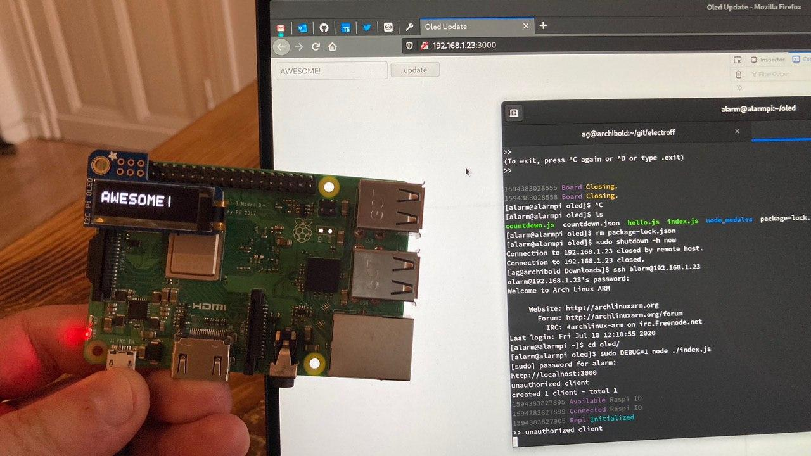

# Raspberry Pi Oled Demo

Install the _pigpio_ first, and reboot the board:

  * in ArchLinux via [python-pigpio](https://aur.archlinux.org/packages/python-pigpio/)
  * in Debian via `sudo apt install pigpio`

Download [package.json](./package.json) and [index.js](./index.js) in any local folder.

Create a `public` folder, via `mkdir -p public`, and download [index.html](./public/index.html) in there.

Find out which IP address your PI has, i.e. via `ip addr`.

Start the demo via `sudo DEBUG=1 node ./index.js` and reach the Pi through any browser on the specified port, i.e. `http://192.168.1.23:3000/`.

